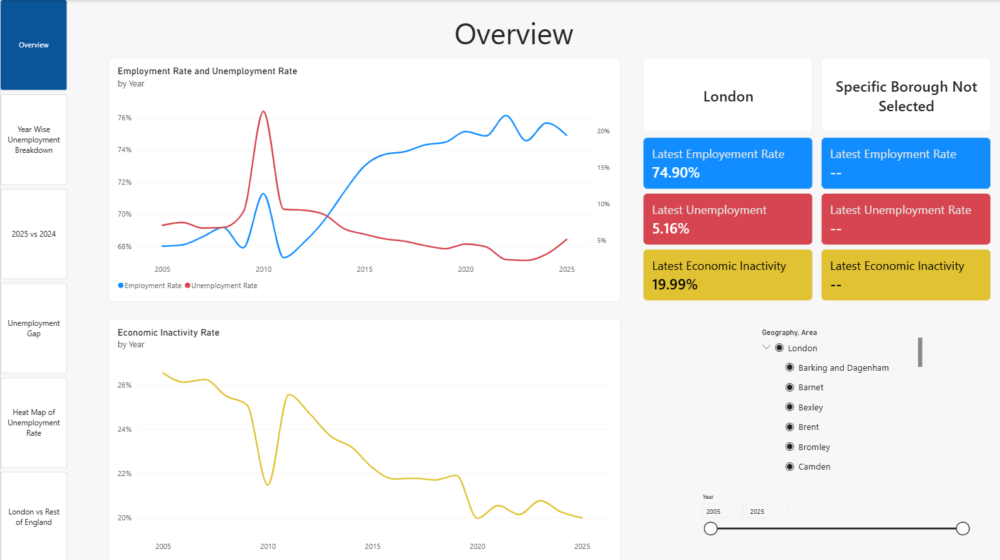
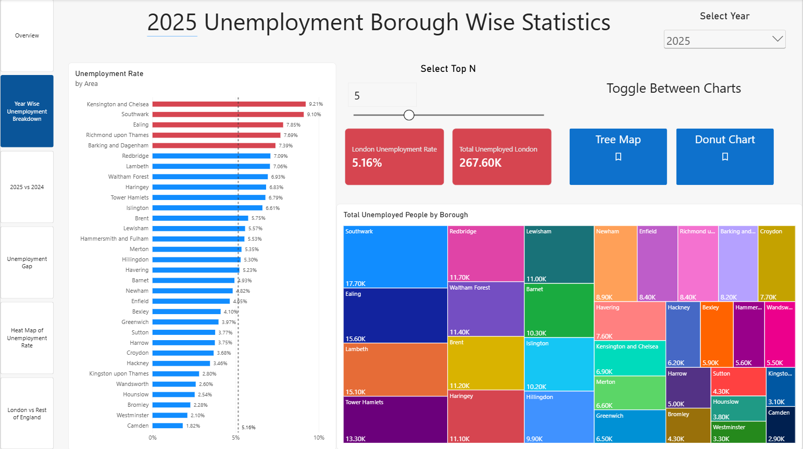
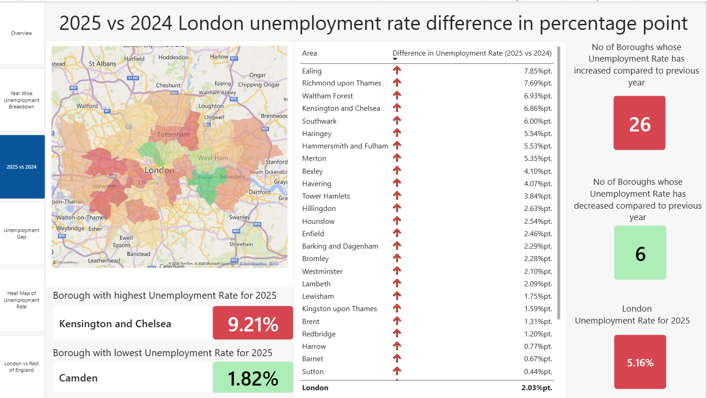
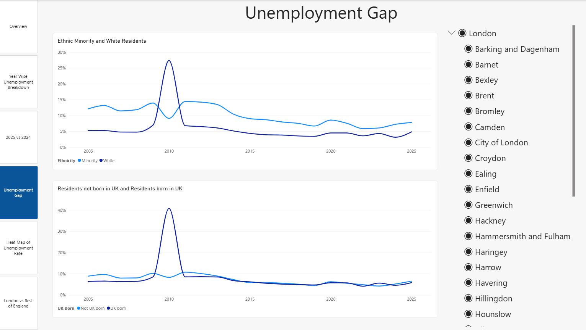
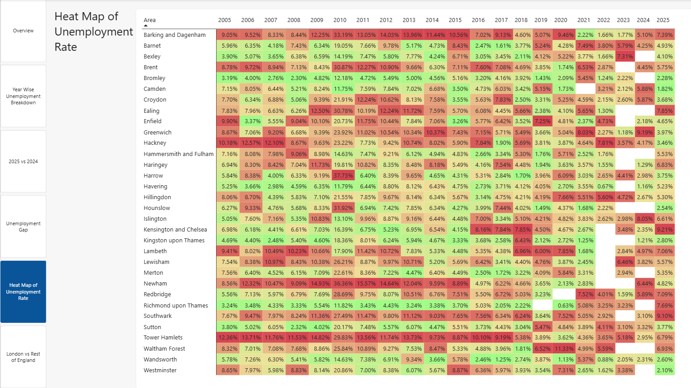
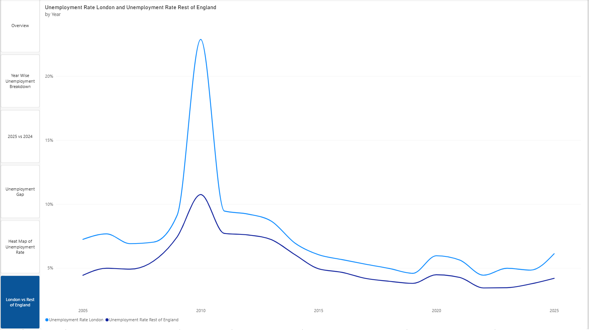
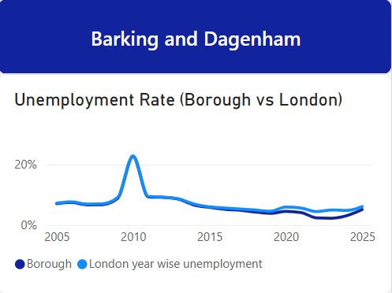

# London Unemployment Analysis
An interactive Power BI dashboard analysing unemployment trends across London's boroughs from 2005 to 2025 using ONS data. Skills used: Power Query (M), Data Modelling, DAX measures and interactive visuals 

## Business Questions & Answers

### 1. Which boroughs consistently have high levels of unemployment?
**Tower Hamlets, Barking and Dagenham, Newham, Southwark and Brent** have consistently had high levels of unemployment over the years.

> **Notable trend:** Newham has improved significantly in recent years, with much lower unemployment levels (2024 is the only exception to this).

### 2. Which boroughs consistently have low levels of unemployment?
**Bromley, Richmond upon Thames, Kingston upon Thames, Havering and Wandsworth** have consistently had low levels of unemployment over the years.

> **Notable trend:** Despite historically low unemployment, Richmond upon Thames has seen a steady rise since 2020, and in 2025 it had the **fourth-highest** unemployment rate in London.

### 3. Has the unemployment rate gone up or down for the year 2025 compared to 2024?
Compared to 2024, London's unemployment rate has **risen by 2.03 percentage points** for 2025, with unemployment increasing in **26 of the 33 boroughs**.

### 4. Is there a difference in unemployment rates by ethnicity?
Ethnic minority groups have **consistently had higher unemployment rates** than White groups over the years. The only exceptions were **2010 and 2023**.

### 5. Is there a difference in unemployment rates between UK-born and non-UK-born residents?
Unemployment rates have been **broadly similar** for people born in the UK and people born outside the UK over the years.

> **Exception:** In 2010, there was a large gap. UK-born residents had a much higher unemployment rate than non-UK-born residents.

### 6. How does London unemplyment rate compare with the rest of england?
For all years the **unemployment rate of London is higher than the unemployment rate of the rest of England.**

## Tech Stack
- **Power BI Desktop**
- **Power Query**
- **Power BI Services**
- **DAX** for calculated measures, calculated columns, calculated tables and time intelligence.
- **Data Modelling**

## Data Source
[Office for National Statistics (ONS)](https://data.london.gov.uk/dataset/economic-activity-rate-employment-rate-and-unemployment-rate-by--2r8lm)

## Data Preparation using Power Query
1. Imported the Excel workbook using `Excel.Workbook()` and filtered it to the sheets for 2005–2025, excluding the metadata sheet.
2. Used `Table.ExpandTableColumn` to combine the data from all year sheets into a single table.
3. Reshaped the data into a long (tidy) format, with one row per borough, year and metric, using Transpose, Pivot/Unpivot, Split Column and Merge Columns.
4. Added a **Geography** column to classify each row by level:
   - **London** for all individual boroughs
   - **Region-London** for the London total row
   - **Country-England** for the England total row

   This separates borough-level data from the published regional and national totals, so aggregate rows are never double-counted, and supports the hierarchy slicer and London vs England comparisons.
5. Applied the changes to load the data into the model (Close & Apply).
6. Created a calculated date table from the years in the data and related it to the main table.

## Power BI Dashboard

### Navigation Bar
A vertical navigation bar runs down the left-hand side of every page, so users can move between pages easily. Hidden pages, such as the tooltip page, are left out of the navigation.

> **Power BI concepts used:** Page navigator

### Page 1: Overview
Provides an overview of the **Unemployment Rate**, **Employment Rate** and **Economic Inactivity Rate** for London as a whole, with the option to drill down into a specific borough for comparison.

#### Key Features
- **KPI cards:** Show all three metrics for London alongside the selected borough for quick comparison. If no borough is selected, the borough cards stay blank.
- **Hierarchical slicer:** Lets you select either the whole of London or a specific borough.
- **Year range slider:** Filters the dashboard to a chosen range of years.
- **Latest-year values:** The cards always show the metrics for the most recent year in the selected range, because averaging rates across several years would not be meaningful.
- **Consistent colour coding:** Each metric has its own colour across all cards — **Employment Rate** in blue, **Unemployment Rate** in red and **Economic Inactivity Rate** in amber, making them easy to tell apart at a glance.

> **Power BI concepts used:** Cards, Hierarchy slicer, Year range slider (Between slicer), DAX measures (latest-year values within the selected range), Conditional display using DAX (borough cards blank when no borough is selected), Consistent colour formatting

### Page 2: Borough-Level Unemployment Statistics
Provides a detailed breakdown of unemployment by borough for a selected year.

#### Key Features
- **Year drop-down slicer:** Selects the year to analyse.
- **Dynamic title:** Built with a Smart Narrative visual whose dynamic value picks up the year chosen in the slicer, so the page heading always shows the selected year.
- **KPI cards:** Show London's unemployment rate and the total number of unemployed people in London for the selected year.
- **Bar chart with London benchmark:** Shows the unemployment rate for every borough, with a constant line marking the London-wide rate. This makes it easy to see which boroughs are above or below the London average.
- **Report page tooltip:** Hovering over a borough in the bar chart shows a line chart comparing that borough's unemployment rate with London's across all years.
- **Top N slicer:** A numeric range parameter (1–15) lets users choose how many of the highest-unemployment boroughs to highlight. The matching bars in the chart turn red, so they stand out at a glance.
- **Treemap and donut chart:** Show how the total number of unemployed people is split across boroughs. Buttons let users switch between the two views.
- When we hover over a specof borogh in the bar chart, a tooltip appears which shows a line chart that comapres the unemplouemnt rate of the secifc bryh with unempterate pf london over all years
> **Power BI concepts used:** Bar chart, Line chart, Treemap, Donut chart, Cards, Smart Narrative (dynamic value), Constant line, Conditional formatting (bars), Slicers, Numeric range parameter (Top N), Dynamic title, Bookmarks & buttons, Selection pane, Tooltip page, DAX measures (for London's Unemployment rate, London's number, Borough unemployment rate), Calculated table (date table built from the years in the data)

### Page 3: 2025 vs 2024
Shows the change in unemployment rate between 2024 and 2025, in **percentage points (%pt)**, for each borough and for London as a whole.

*Change (%pt) = 2025 unemployment rate − 2024 unemployment rate*

#### Key Features
- **Filled map:** Colours each borough by its change in unemployment rate. Red shows an increase and green shows a decrease, and deeper shades show larger changes.
- **Table with conditional icons:** Lists the %pt change for each borough and for London. A red up arrow marks an increase in unemployment and a green down arrow marks a decrease.
- **KPI cards (7):**
  - Borough with the **highest** unemployment rate, and its rate
  - Borough with the **lowest** unemployment rate, and its rate
  - Number of boroughs where unemployment **increased**
  - Number of boroughs where unemployment **decreased**
  - **2025 unemployment rate:** shows London's rate by default, or the selected borough's rate when a borough is selected
- **Consistent colour scheme:** Red for increases and green for decreases across the map, table and cards.

> **Power BI concepts used:** Filled map, Table, Cards, Conditional formatting (diverging colour scale on map, icons in table), DAX measures (year-on-year change in %pt, highest/lowest borough, count of boroughs increased/decreased, dynamic London/borough rate)

### Page 4: Unemployment Gap
Compares unemployment rates between population groups over time:
- **Ethnic minority vs White** residents
- **UK-born vs non-UK-born** residents

#### Key Features
- **Two line charts:** One compares unemployment rates for ethnic minority and White residents, and the other compares UK-born and non-UK-born residents, making the gap between each pair easy to see over time.
- **Hierarchical slicer:** Lets you view the comparison for the whole of London or a specific borough.

> **Power BI concepts used:** Line charts, Hierarchy slicer, DAX measures

### Page 5: Unemployment Rate Heat Map
A matrix with boroughs as column headers, years as row headers and the unemployment rate as values, showing how each borough's position has changed over time.

#### Key Features
- **Matrix heat map:** Each cell is coloured by the borough's unemployment rank for that year, using conditional background formatting. Rank 1 means the highest unemployment rate. Cells range from **dark red** (rank 1, highest unemployment) to **light green** (lowest unemployment), so boroughs that are consistently high or low stand out as solid bands of colour.
- **Missing data handling:** Cells with no data are shaded white, so gaps aren't mistaken for real values.

> **Power BI concepts used:** Matrix, Conditional formatting (background colour), DAX measures (unemployment rank)

### Page 6: London vs Rest of England
Compares London's unemployment rate with the rest of England over time.

#### Key Features
- **Full-page line chart:** A simple, uncluttered view that makes it easy to compare the two trends over the full period.
- **Rest of England calculation:** Calculated from the published England and London totals (England minus London), so London is not counted on both sides of the comparison.

> **Power BI concepts used:** Line chart, DAX measures (Rest of England unemployment rate, using the Geography column to separate regional and national totals)

### Page 7: Borough vs London Tooltip (Hidden Page)
A hidden report page used as the tooltip for the bar chart on Page 2. When you hover over a borough, it shows a line chart comparing that borough's unemployment rate with London's across all years.

> **Power BI concepts used:** Report page tooltip, Hidden page, Line chart

